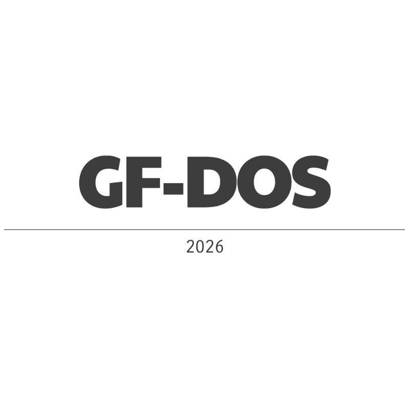

  

🌌 GF‑DOS — Retro Computing Reborn
Un écosystème moderne conçu pour FreeDOS 1.4, les Pentium‑class machines, DOSBox, 86Box, et tout passionné de rétro‑computing qui veut ramener Internet dans le monde DOS.

GF‑DOS regroupe :

GF‑NetStack (DOS) — moteur réseau moderne

GF‑Web (DOS) — navigateur mobile‑friendly

GF‑DOS Wiki — documentation complète

GF‑DOS Hardware Guides — compatibilité matériel

GF‑DOS PCMCIA Drivers — exemples de drivers

GF‑DOS n’est pas un simple projet.
C’est un univers modulaire, pensé pour durer, documenter, et inspirer.

🚀 Objectifs du projet
Offrir un moteur réseau moderne pour DOS (HTTP, WebSocket, FTP, SMTP, POP3).

Ajouter le support TLS 1.2 via BearSSL DOS (HTTPS + wss://).

Créer un navigateur DOS moderne basé sur HTML mobile + UI curses.

Documenter comment connecter FreeDOS à Internet sur vrai hardware.

Fournir des drivers PCMCIA, guides, et exemples de configuration.

Construire un écosystème écologique, portable, modulaire, pour les développeurs rétro.

🧱 Modules GF‑DOS
1. GF‑NetStack (DOS)
Le cœur réseau de l’univers GF‑DOS.

Fonctionnalités actuelles :

HTTP 1.1

WebSocket ws://

FTP / SMTP / POP3

API simple pour C, Fortran, Lua

Build statique DJGPP pour FreeDOS 1.4

À venir :

TLS 1.2 (BearSSL DOS)

HTTPS

WebSocket sécurisé wss://

2. GF‑Web (DOS)
Le navigateur mobile‑friendly pour FreeDOS.

Fonctionnalités prévues :

rendu HTML mobile minimal

CSS minimal

images ASCII / blocs curses

interface curses moderne

recherche YouTube mobile

boutons “Télécharger”

WebSocket temps réel

HTTPS / wss:// (via BearSSL DOS)

GF‑Web est la vitrine de l’univers GF‑DOS.

3. GF‑DOS Wiki
Documentation officielle, claire et accessible.

Contient :

installation FreeDOS 1.4

setup réseau onboard

setup réseau PCMCIA

Packet Drivers

mTCP

API GF‑NetStack

UI GF‑Web

troubleshooting

4. GF‑DOS Hardware Guides
Guides pour connecter FreeDOS à Internet sur du vrai hardware.

Onboard Ethernet
Intel PRO/100

Broadcom 440x

Realtek RTL8139

Packet Drivers

DHCP

tests mTCP

PCMCIA
Socket Services

Card Services

3Com 3C589 / 3C562

Xircom RealPort

Intel EtherExpress PCMCIA

exemples de CONFIG.SYS / AUTOEXEC.BAT

5. GF‑DOS PCMCIA Driver Examples
Exemples complets pour configurer le réseau PCMCIA sous FreeDOS.

Code
DEVICE=SSPCIC.EXE
DEVICE=CS.EXE
DEVICE=CARDID.EXE
3C589PD.COM 0x60
DHCP
Avec explications, captures d’écran, et diagnostics.

🛠️ Build & Toolchain
GF‑DOS utilise :

DJGPP cross‑compiler (Ubuntu 24.04 → FreeDOS 1.4)

builds statiques .a

EXE DPMI 32‑bit compatibles FreeDOS

API portable C / Fortran / Lua

🤝 Contributions
GF‑DOS est conçu pour être :

modulaire

documenté

accessible

rétro‑écologique

Les contributions sont les bienvenues :
drivers, documentation, modules, tests sur vrai hardware.

---------------------------------------------------------------

🔥 Roadmap

🗺️ GF‑DOS Roadmap — From FreeDOS Install → BearSSL Port

🧊 Phase 0 — Préparation du hardware IBM ThinkPad R50(Pentium M), IBM ThinkPad R40e(Pentium 4) & IBM ThinkPad 770ED(Pentium II MMX)
Objectif : avoir une machine rétro stable, propre, prête pour FreeDOS.

Étapes :
Wipe Windows XP

vérifier le BIOS (mode Legacy, pas ACPI)

activer l’Ethernet onboard

préparer une clé USB ou DvD FreeDOS 1.4

vérifier que le disque dur est en LBA (Partionnement & Formatage)

🟦 Phase 1 — Installation FreeDOS 1.4 sur vrai hardware
Objectif : un système DOS propre, stable, minimal.

Étapes :
booter sur la clé USB ou dvd FreeDOS 1.4

installer en mode “Full”

choisir FreeDOS kernel + JEMMEX

installer EDIT, HIMEM, etc.

redémarrer et vérifier que tout fonctionne

🟩 Phase 2 — Setup réseau onboard (Intel PRO/100, Broadcom, Realtek)
Objectif : avoir Internet sur FreeDOS via Ethernet onboard.

Étapes :
télécharger le Packet Driver DOS pour ta carte

copier dans C:\DRIVERS\ETHERNET

ajouter dans AUTOEXEC.BAT :

Code example :

C:\DRIVERS\ETHERNET\PRO100PD.COM 0x60

SET MTCPCFG=C:\MTCP\CONFIG.CFG

C:\MTCP\DHCP.EXE

----------------------------------

IBM ThinkPad R50: 

copy C:\FREEDOS\DRIVERS\E1000PKT.COM C:\NET\

- ajouter dans AUTOEXEC.BAT :

C:\NET\E1000PKT.COM 0x60 1 1000 FULL

C:\NET\MTCP\DHCP.EXE

- ajouté a FDAUTO.BAT :

call C:\AUTOEXEC.BAT

- Reboot... Enjoy !

- Docs & Guide + Trouble shooting complet a venir...

-----------------------------

créer C:\MTCP\CONFIG.CFG :

Code
PACKETINT 0x60
HOSTNAME PENTIUMM

----------------------------
redémarrer

tester :

Code
DHCP
PING 8.8.8.8
Si ça marche → réseau DOS opérationnel.

🟨 Phase 3 — Tests mTCP
Objectif : valider que le réseau DOS est stable avant GF‑NetStack.

Tests :
FTPSRV

HTGET http://example.com

TELNET towel.blinkenlights.nl

PING google.com

Si tout passe → tu es prêt pour GF‑NetStack DOS.

🔥 Phase 4 — Build GF‑NetStack DOS (version non‑TLS)
Objectif : compiler ton moteur réseau DOS depuis Ubuntu 24.04.

Étapes :
installer DJGPP cross‑compiler (voir plus haut...)

compiler en .o :

Code
i586-pc-msdosdjgpp-gcc -O2 -c gfnet_http.c
i586-pc-msdosdjgpp-gcc -O2 -c gfnet_ws.c
créer la lib statique :

Code
i586-pc-msdosdjgpp-ar rcs libgfnetstack.a *.o
compiler un EXE test :

Code
i586-pc-msdosdjgpp-gcc test_http.c libgfnetstack.a -o test.exe
copier sur FreeDOS

tester HTTP + WebSocket ws://

Quand ça marche → GF‑NetStack DOS v0.1 validé.

🟥 Phase 5 — Préparation du port BearSSL → DOS
Objectif : préparer ton wrapper GF‑NetStack pour recevoir TLS.

Étapes :
isoler les fonctions I/O (send/recv)

créer une abstraction :

Code
gf_tls_read()
gf_tls_write()
gf_tls_handshake()
préparer un module gf_tls_stub.c

vérifier que GF‑NetStack compile sans TLS

Tu prépares le terrain.

🟧 Phase 6 — Portage BearSSL → DOS
Objectif : faire tourner TLS 1.2 sur FreeDOS.

Étapes :
compiler BearSSL avec DJGPP

désactiver les algos trop lourds

adapter le RNG (DOS entropy)

intégrer dans GF‑NetStack

tester handshake TLS :

Code
https://example.com
https://neverssl.com
https://api.github.com
Quand ça marche → tu viens de créer BearSSL DOS.

🟪 Phase 7 — GF‑NetStack DOS v1.0 (TLS + HTTPS + wss://)
Objectif : finaliser ton moteur réseau moderne DOS.

Fonctionnalités :
HTTP 1.1

HTTPS (TLS 1.2)

WebSocket ws://

WebSocket wss://

FTP/FTPS

SMTP/SMTPS

POP3/POP3S

Tu as maintenant le premier stack réseau moderne pour FreeDOS depuis 25 ans.

🟫 Phase 8 — GF‑Web (DOS) prototype
Objectif : commencer ton navigateur DOS mobile‑friendly.

Étapes :
UI curses

HTML mobile minimal

CSS minimal

images ASCII

liste YouTube mobile

bouton “Télécharger”

API JSON

WebSocket chat

GF‑Web devient la vitrine de GF‑DOS.

🧭 Résumé du Roadmap GF‑DOS
Voici ton plan complet, clair :

Installer FreeDOS 1.4

Configurer réseau onboard

Tester mTCP

Compiler GF‑NetStack DOS

Préparer wrapper TLS

Porter BearSSL → DOS

Activer HTTPS + wss://

Construire GF‑Web DOS

-----------------------------------------------
(*) = Done

[ ] Phase 0  

- 770ED ()

- R40e ()

- R50 (*)

[ ] Phase 1

- 770ED ()

- R40e ()

- R50 () Reste 4dos & doslfn a install

[ ] Phase 2

- 770ED ()

- R40e ()

- R50 (*)

[ ] Phase 3

- 770ED ()

- R40e ()

- R50 (*)

[ ] Phase 4

[ ] Phase 5

[ ] Phase 6

[ ] Phase 7

[ ] Phase 8

--------------------------------------------

[ ] GF‑NetStack DOS v0.1 (HTTP + WebSocket)

[ ] GF‑NetStack DOS v0.2 (FTP/SMTP/POP3)

[ ] BearSSL DOS port (TLS 1.2)

[ ] GF‑Web v0.1 (HTML mobile minimal)

[ ] GF‑Web v0.2 (images ASCII)

[ ] GF‑Web v0.3 (YouTube mobile + téléchargement)

[ ] GF‑Web v1.0 (HTTPS + wss://)

[ ] Wiki complet

[ ] Hardware guides

[ ] PCMCIA drivers

📬 Contact & Support
GF‑DOS est un projet passionné, conçu pour la communauté rétro.
Pour questions, idées, ou contributions :
→ ouvrir une issue dans le repo GitHub (à venir)
